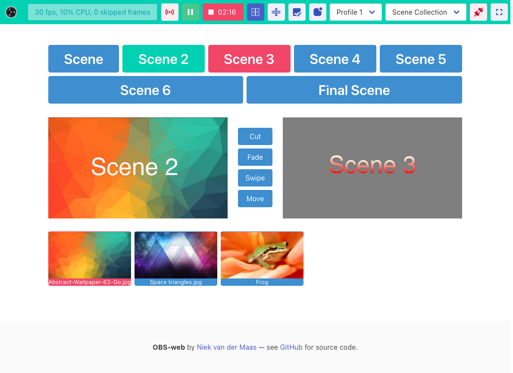

# OBS-web

<!-- ALL-CONTRIBUTORS-BADGE:START - Do not remove or modify this section -->
[](#contributors-)
<!-- ALL-CONTRIBUTORS-BADGE:END -->

#### The easiest way to control [OBS](https://obsproject.com/) remotely

### **URL: http://obs-web.niek.tv/**

###### Download latest build [here](https://github.com/Niek/obs-web/archive/gh-pages.zip)

---

#### Screenshot:



#### Features:

- No installation or extra software is needed, works in any modern browser (desktop + mobile)
- Support for local network and internet control through [WSS tunnels](https://github.com/obsproject/obs-websocket/blob/4.x-compat/SSL-TUNNELLING.md)
- Easily switch scenes and start/stop streaming and recording
- Support for Studio Mode (preview and program scenes)
- Support for Virtual Camera
- Live view of preview & output, updating 1 fps
- Fullscreen button and wakelock support (keeps the screen on)
- Replay Buffer button
- Easy bookmarking/deeplink by specifying host in URL
- Profile switching support
- Scene Collections switching support
- Custom transition support
- Extra features:
  - Hide scenes that have `(hidden)` in their name
  - Switch sources in scenes with `(switch)` in their name visually by thumbnails


---

#### Requirements:

- [OBS](https://obsproject.com/) v28 or higher - this includes the latest version of the OBS-websocket plugin
  - OBS v27 is also supported, by manually installing the [OBS-websocket v5](https://github.com/obsproject/obs-websocket/releases/latest) plugin
  - For older OBS versions, use the [OBS-websocket v4](https://github.com/obsproject/obs-websocket/releases/tag/4.9.1-compat) plugin and [OBS-web v4](http://obs-web.niek.tv/v4/) (no longer maintained)
- Enabling the OBS-websocket server in OBS under `Tools -> obs-websocket Settings -> Enable WebSocket Server`
- Optionally: a tunnel service if you want to control OBS outside your local network, [see these instructions](https://github.com/obsproject/obs-websocket/blob/4.x-compat/SSL-TUNNELLING.md)

---

#### Build instructions:

```bash
npm ci
npm run dev # or: npm run build
```

#### Docker:

```bash
docker run --rm -p5000:5000 ghcr.io/niek/obs-web
```

## Contributors ✨

Thanks goes to these wonderful people ([emoji key](https://allcontributors.org/docs/en/emoji-key)):

<!-- ALL-CONTRIBUTORS-LIST:START - Do not remove or modify this section -->
<!-- prettier-ignore-start -->
<!-- markdownlint-disable -->
<table>
  <tbody>
    <tr>
      <td align="center" valign="top" width="14.28%"><a href="https://github.com/verstaerker-583"><br /><sub><b>verstaerker-583</b></sub></a><br /><a href="https://github.com/Niek/obs-web/commits?author=verstaerker-583" title="Code">💻</a></td>
      <td align="center" valign="top" width="14.28%"><a href="http://crazy4groovy.blogspot.ca"><br /><sub><b>crazy4groovy</b></sub></a><br /><a href="https://github.com/Niek/obs-web/issues?q=author%3Acrazy4groovy" title="Bug reports">🐛</a></td>
      <td align="center" valign="top" width="14.28%"><a href="https://github.com/isctylr"><br /><sub><b>Isaac Taylor</b></sub></a><br /><a href="https://github.com/Niek/obs-web/commits?author=isctylr" title="Code">💻</a> <a href="#ideas-isctylr" title="Ideas, Planning, & Feedback">🤔</a></td>
      <td align="center" valign="top" width="14.28%"><a href="https://github.com/darthclide"><br /><sub><b>darthclide</b></sub></a><br /><a href="https://github.com/Niek/obs-web/issues?q=author%3Adarthclide" title="Bug reports">🐛</a></td>
      <td align="center" valign="top" width="14.28%"><a href="https://blog.rodrigograca.com/"><br /><sub><b>Rodrigo Graça</b></sub></a><br /><a href="https://github.com/Niek/obs-web/commits?author=rodrigograca31" title="Documentation">📖</a></td>
      <td align="center" valign="top" width="14.28%"><a href="https://github.com/feitosa-daniel"><br /><sub><b>Daniel Feitosa</b></sub></a><br /><a href="https://github.com/Niek/obs-web/commits?author=feitosa-daniel" title="Code">💻</a></td>
      <td align="center" valign="top" width="14.28%"><a href="http://linkedin.com/in/arun-woosaree"><br /><sub><b>Arun Woosaree</b></sub></a><br /><a href="https://github.com/Niek/obs-web/commits?author=Arunscape" title="Code">💻</a></td>
    </tr>
    <tr>
      <td align="center" valign="top" width="14.28%"><a href="https://avil13.com"><br /><sub><b>Aleksey Pivkin</b></sub></a><br /><a href="https://github.com/Niek/obs-web/commits?author=avil13" title="Code">💻</a> <a href="#ideas-avil13" title="Ideas, Planning, & Feedback">🤔</a></td>
      <td align="center" valign="top" width="14.28%"><a href="http://www.nathaneaston.com/"><br /><sub><b>Nathan Easton</b></sub></a><br /><a href="https://github.com/Niek/obs-web/commits?author=ndragon798" title="Code">💻</a></td>
      <td align="center" valign="top" width="14.28%"><a href="https://www.shortcord.com"><br /><sub><b>Tristan Smith</b></sub></a><br /><a href="https://github.com/Niek/obs-web/issues?q=author%3Ateh-random-name" title="Bug reports">🐛</a></td>
      <td align="center" valign="top" width="14.28%"><a href="http://filiphanes.sk"><br /><sub><b>Filip Hanes</b></sub></a><br /><a href="https://github.com/Niek/obs-web/commits?author=filiphanes" title="Code">💻</a> <a href="#ideas-filiphanes" title="Ideas, Planning, & Feedback">🤔</a> <a href="#design-filiphanes" title="Design">🎨</a> <a href="https://github.com/Niek/obs-web/issues?q=author%3Afiliphanes" title="Bug reports">🐛</a></td>
      <td align="center" valign="top" width="14.28%"><a href="https://github.com/TotalInternalReflection"><br /><sub><b>TotalInternalReflection</b></sub></a><br /><a href="https://github.com/Niek/obs-web/issues?q=author%3ATotalInternalReflection" title="Bug reports">🐛</a></td>
      <td align="center" valign="top" width="14.28%"><a href="https://www.nossa.me/"><br /><sub><b>Alessio Nossa</b></sub></a><br /><a href="#ideas-alessionossa" title="Ideas, Planning, & Feedback">🤔</a></td>
      <td align="center" valign="top" width="14.28%"><a href="https://tt2468.net"><br /><sub><b>tt2468</b></sub></a><br /><a href="#ideas-tt2468" title="Ideas, Planning, & Feedback">🤔</a></td>
    </tr>
    <tr>
      <td align="center" valign="top" width="14.28%"><a href="https://github.com/donahuetech"><br /><sub><b>donahuetech</b></sub></a><br /><a href="https://github.com/Niek/obs-web/commits?author=donahuetech" title="Code">💻</a> <a href="#ideas-donahuetech" title="Ideas, Planning, & Feedback">🤔</a></td>
      <td align="center" valign="top" width="14.28%"><a href="https://github.com/AshwinSatyawan"><br /><sub><b>AshwinSatyawan</b></sub></a><br /><a href="https://github.com/Niek/obs-web/commits?author=AshwinSatyawan" title="Documentation">📖</a></td>
      <td align="center" valign="top" width="14.28%"><a href="https://github.com/ewized"><br /><sub><b>ewized</b></sub></a><br /><a href="https://github.com/Niek/obs-web/commits?author=ewized" title="Code">💻</a></td>
      <td align="center" valign="top" width="14.28%"><a href="https://github.com/bzip22"><br /><sub><b>bzip22</b></sub></a><br /><a href="https://github.com/Niek/obs-web/commits?author=bzip22" title="Code">💻</a></td>
    </tr>
  </tbody>
</table>

<!-- markdownlint-restore -->
<!-- prettier-ignore-end -->

<!-- ALL-CONTRIBUTORS-LIST:END -->

This project follows the [all-contributors](https://github.com/all-contributors/all-contributors) specification. Contributions of any kind welcome!
